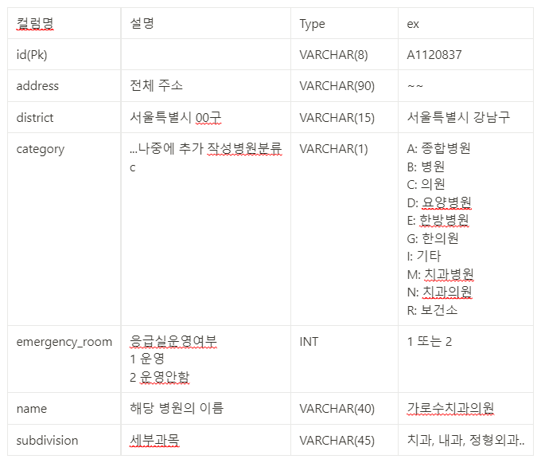
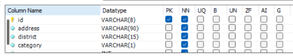
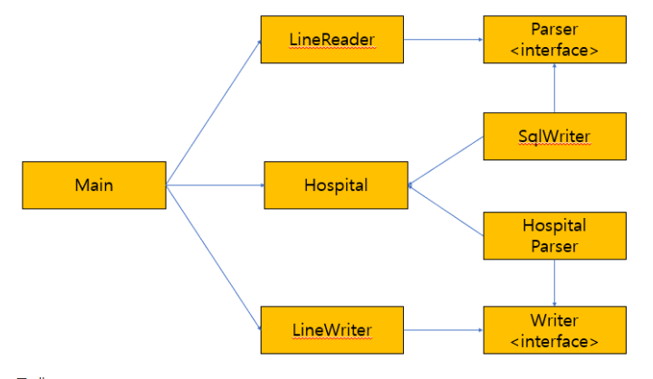

# 10/14_서울시 병원 데이터 처리

# 📢 서울시 병원 데이터 처리

## 1. 데이터

[서울시 병의원 위치 정보.csv](https://drive.google.com/file/d/1mgfjKNkboPUX_9AOWc_Qil0z9MwASQej/view?usp=sharing)

## 2. 목표

<aside>
💡 서울시 병원 데이터를 읽고, db에 입력하여 데이터를 처리 할 수 있다.

</aside>

## 3. 공공데이터 모델링 실습

### 요구사항 분석

1. 병원 분류의 개수
2. 병원 분류 별 병원 개수
3. 서울의 구별로 각 병원의 개수
4. 병원이 가장 많은 구
5. 세부 분과 별로 병원의 개수

### 개념적 설계

### 물리적 설계

### 과정 개요

1. csv 파일 한줄씩 읽기
2. 읽어온 한줄을 Hospital 객체에 split하여 정보 저장
3. Hospital 객체의 정보를 이용해 insert 쿼리문 string을 작성 후 리스트에 저장
3. 모든 파일을 읽은 후 생성된 String List를 읽어 파일에 입력
4. 해당 파일을 mysql 워크벤치로 불러와 데이터를 insert한다.

## 4. 코드 구조
### 클래스 다이어그램

- 클래스
    - main : LineReader, LineWriter를 사용하여 파일을 파싱하는 클래스
    - LIneReader : 파일을 읽어와서 파싱하는 클래스
    - LineWriter : 파일에 sql문을 작성하는 클래스
    - Hospital : 병원 정보는 담는 클래스
    - SqlWriter : LineWriter를 통해서 파일에 입력할 때 sql문 string을 반환해주는 클래스
    - HospitalParser : LineReader를 통해서 파일을 파싱할 때 Hospital클래스의 객체에 정보를 담아 객체를 반환해주는 클래스
- 인터페이스
    - Parser : LineReader 클래스를 사용할 때 Parser 인터페이스를 통해서 다형성을 실현하고, 다양한 형태의 List들을 반환한다.
    - Writer : LineWrite 클래스를 사용할 때 Writer 인터페이스를 통해서 다형성을 실현하고, 다양한 형태의 string을 반환한다. (ex. sql문 또는 병원의 정보를 담은 toString문)
### 테스트 코드
### 테스트가 필요한 부분

1. id(병원의 id)가 잘 파싱되었는지
2. address(병원의 주소)가 잘 파싱되었는지
3. district(시와 구)가 잘 파싱되었는지
4. category(의원, 병원 구분)가 잘 파싱되었는지
5. emergency_room(응급실 존재 여부)이 잘 파싱되었는지
6. name(병원이름)이 잘 파싱되었는지
7. subdivision(세부분과)이 잘 파싱되었는지